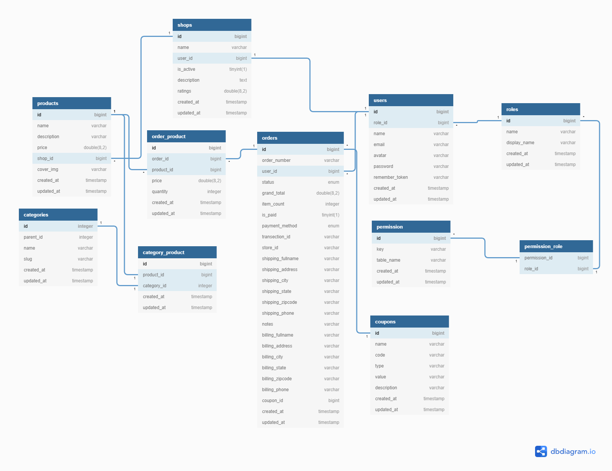

# **Deal Ocean**

---

# **Schema Diagram**

---



---

# Model | Migration | Controller | Policy | Observer

| Models     | Migrations       | Controllers          | Policies | Observers | Seed              |
| ---------- | ---------------- | -------------------- | -------- | --------- | ----------------- |
| -          | -                | Dashboard            | -        | -         | -                 |
| -          | -                | -                    | -        | -         | SuperAdminSeeder  |
| User       | users            | UserController       |          |           |                   |
| Shop       | shops            | ShopController       |          |           |                   |
| Location   | locations        | LocationController   |          |           |                   |
| Country    | countries        | CountryController    |          |           |                   |
| Region     | regions          | RegionController     |          |           |                   |
| Role       | roles            | RoleController       |          |           |                   |
|            | role_user        |                      |          |           |                   |
| Permission | permissions      | PermissionController |          |           |                   |
| -          | permission_role  |                      |          |           |                   |
| Coupon     | coupons          | CouponController     |          |           |                   |
| Category   | categories       | CategoryController   |          |           |                   |
| Product    | products         | ProductController    |          |           | ProductSeeder     |
| -          | category_product |                      |          |           |                   |
| Order      | orders           | OrderController      |          |           |                   |
| -          | order_product    |                      |          |           |                   |
| -          | -                | CartController       |          |           |                   |
| Slider     | sliders          | SliderController     |          |           | SliderSeeder '\*' |
| Banner     | banners          | BannerController     |          |           | BannerSeeder '\*' |

---

# **Some Basic Understanding of Elequent Relationship**

-   One To One : hasOne(), belongsTo()
-   One To Many : hasMany()
-   Many To Many: belongsToMany()

---

## **One To One**

### tables

`users`

`phones`

### Models

`User`

`Phone`

### **Table:** `phones`

```php
Schema::create('phones', function (Blueprint $table) {
    $table->bigIncrements('id');
    $table->string('phone');
    $table->unsignedBigInteger('user_id');
    $table->timestamps();

    $table->foreign('user_id')->references('id')->on('users');
});
```

> Here `user_id` is foreign key in `phones` table. And the primary key of this is in `users` tables

### **Model:** `Phone.php`

```php
<?php

namespace App;

use Illuminate\Database\Eloquent\Model;

class Phone extends Model
{
    protected $guarded = [];

    public function user()
    {
        return $this->belongsTo(User::class);
    }
}
```

> Create `user` relationship in that `Phone` model.

> `belongsTo` because, the table that has `references` (fk) here `user_id` in phones is the one that will use `belongsTo` in relationship.

### **Model:** `User.php`

```php
public function phone()
{
    return $this->hasOne(Phone::class);
}
```

> Create `phone` relationship in that `User` model

> `hasOne` because, the table we are `referencing` is the one which will use `hasOne` in relationship.

---

## **One To Many** (Most Commonly Used Relationship)

**Idea:** States that there is one owner and that owner has many of the secondary property

### tables

`users`

`posts`

### Models

`User`

`Post`

### **Table:** `posts`

```php
Schema::create('posts', function (Blueprint $table) {
    $table->bigIncrements('id');
    $table->unsignedBigInteger('user_id');
    $table->string('title');
    $table->text('body');
    $table->timestamps();
});
```

### **Model:** `Post.php`

```php
<?php

namespace App;

use Illuminate\Database\Eloquent\Model;

class Post extends Model
{
    protected $guarded = [];

    public function user()
    {
        return $this->belongsTo(\App\User::class);
    }
}
```

> Create `user` relationship in that `Post` model.

> `belongsTo` because, the table that has `references` (fk) here `user_id` in posts is the one that will use `belongsTo` in relationship.

> A `post` can be posted by only one user so it should be `belongsTo` relationship.

### **Model:** `User.php`

```php
public function posts()
{
    return $this->hasMany(\App\Post::class);
}
```

> Create `posts` relationship in `User` model.

> And an user can have many posts. So the relationship is `hasMany`

## **Many To Many**

### tables

`categories`

`products`

`category_product`

> Here `category_product` is intermediate table

> And one thing to note that, here `categories` and `products` are not directly coonnected. Instead they connected though `category_product` table

### Models

`Category`

`Product`

> Note: We don't need to create Model for `intermediate` table. We just create a migration for the table.

### **Table:** `categories`

```php
Schema::create('categories', function (Blueprint $table) {
    $table->increments('id');
    $table->string('title');
    $table->timestamps();
});
```

### **Table:** `products`

```php
Schema::create('products', function (Blueprint $table) {
    $table->increments('id');
    $table->string('name');
    $table->float('price');
    $table->timestamps();
});
```

### **Table:** `category_product` (Pivot Table)

```php
Schema::create('category_product', function (Blueprint $table) {
    $table->increments('id');
    $table->integer('category_id')->unsigned();
    $table->integer('product_id')->unsigned();
});
```

### **Model:** `Product.php`

```php
<?php

namespace App;

use Illuminate\Database\Eloquent\Model;

class Product extends Model
{
    public function categories()
    {
        return $this->belongsToMany(Category::class);
    }
}
```

### **Model:** `Category.php`

```php
<?php

namespace App;

use Illuminate\Database\Eloquent\Model;
use App\Product;

class Category extends Model
{
    public function products()
    {
        return $this->belongsToMany(Product::class);
    }
}
```

Create a Product

`ProductController.php`

```php
<?php

namespace App\Http\Controllers;
use App\Category;
use App\Product;

use Illuminate\Http\Request;

class ProductController extends Controller
{
    public function create(Request $request)
    {
        $product = new Product;
        $product->name = 'God of War';
        $product->price = 40;

        $product->save();

        $category = Category::find([3, 4]);
        $product->categories()->attach($category);

        return 'Success';
    }
}
```

> First, we have created the Product and save it in the products table. Now, it is time to assign the categories to the newly created Product.

> Since we just need an ID of categories, so right now, I have coded manually, but in real-time, you have those ids in the form request.

> Now, attach() function will assign those category ids to the newly created Product and also create two new rows inside the pivot table. Each row has a relationship with its Product and category.

```php
// show.blade.php
<h2>Product Name: </h2>
<p>{{ $product->name }} || ${{ money_format($product->price, 2) }}</p>

<h3>Product Belongs to</h3>

<ul>
    @foreach($product->categories as $category)
    <li>{{ $category->title }}</li>
    @endforeach
</ul>
```

**Detach() function.**

`ProductController.php`

```php
public function removeCategory(Product $product)
{
    $category = Category::find(3);
    $product->categories()->detach($category);
    return 'Success';
}
```

---

### Creating only migration

```cmd
php artisan make:migration create_category_product_table --create category_product
```

> `create_ + pivotTable + _table`

> here pivot table contains two table and table names should present in `alphabetical order`.

One important thing

```php
return $this->belongsToMany(Product::class, 'order_items', 'order_id', 'product_id')->withPivot('quantity', 'price');
```

> Here `order_items` is pivot table. `order_items` is column name of this table. And `product_id` id the column name of foreign table (Product)

---

# **Some relationship in our Database Design**

---

-   `Order` **belongsToMany** `Product`
-   `Order` **belongsTo** `User`
-   `Product` **belongsTo** `Shop`
-   `Shop` **hasMany** `Product`
-   `Shop` **belongsTo** `User`
-   `User` **hasOne** `Shop`

---

# **Commands | Model | Migrations**

```cmd
~$ php artisan make:model Model -a
```

> Creates everything

```cmd
~$ php artisan make:model Model -a
```

> Creates Model, Controller and Migration

```cmd
~$ php artisan make:migration create_permission_role_table
```

> Creates only migrations

---

# **Created all the Model, Controllers, migration and seeds initially**

---

# **Set remember_token column**

---

`Model.php`

```php
protected $fillable = [
    'name', 'email', 'password', 'remember_token'
];
```

`Controller.php`

```php
protected function create(array $data)
{
    return User::create([
        'name' => $data['name'],
        'email' => $data['email'],
        'password' => Hash::make($data['password']),
        'remember_token' => Str::random(60),
    ]);
}
```

---

# **Created all the table columns**

---

# **Created all the relationship among models**

---

# **Front End Design Completed**

---

# **Create a Super Admin using Seeder**

---

`SuperAdminSeeder.php`

```php
<?php

use App\Role;
use App\User;
use Illuminate\Database\Seeder;
use Illuminate\Support\Facades\DB;
use Illuminate\Support\Facades\Hash;

class SuperAdminSeeder extends Seeder
{
    /**
     * Run the database seeds.
     *
     * @return void
     */
    public function run()
    {
        $user = User::create(['name' => 'Imrul Hasan', 'email' => 'imrulhasan273@gmail.com', 'password' => Hash::make('imrulhasan')]);
        $role = Role::create(['name' => 'super_admin', 'display_name' => 'Super Admin']);
        DB::table('role_user')->insert(['user_id' => $user->id, 'role_id' => $role->id]);
    }
}
```

`DatabaseSeeder.php`

```php
<?php

use Illuminate\Database\Seeder;

class DatabaseSeeder extends Seeder
{
    /**
     * Seed the application's database.
     *
     * @return void
     */
    public function run()
    {
        $this->call(SuperAdminSeeder::class);
    }
}
```

Now run the following commands.

```cmd
~$ composer dump-autoload
```

```cmd
~$ php artisan db:seed
~$ php artisan migrate:fresh --seed
```

---

# **Login And Registration Page Done**

# **Loader System**

`x.blade.php`

```php
<!-- Start Page Preloder -->
<div id="preloder">
    <div class="loader">
    </div>
</div>
<!-- End Page Preloder -->
```

`loader.css`

```css
/* Preloder */
#preloder {
    position: fixed;
    width: 100%;
    height: 100%;
    top: 0;
    left: 0;
    z-index: 999999;
    background: #000;
}

.loader {
    width: 40px;
    height: 40px;
    position: absolute;
    top: 50%;
    left: 50%;
    margin-top: -13px;
    margin-left: -13px;
    border-radius: 60px;
    animation: loader 0.8s linear infinite;
    -webkit-animation: loader 0.8s linear infinite;
}

@keyframes loader {
    0% {
        -webkit-transform: rotate(0deg);
        transform: rotate(0deg);
        border: 4px solid #f44336;
        border-left-color: transparent;
    }
    50% {
        -webkit-transform: rotate(180deg);
        transform: rotate(180deg);
        border: 4px solid #673ab7;
        border-left-color: transparent;
    }
    100% {
        -webkit-transform: rotate(360deg);
        transform: rotate(360deg);
        border: 4px solid #f44336;
        border-left-color: transparent;
    }
}

@-webkit-keyframes loader {
    0% {
        -webkit-transform: rotate(0deg);
        border: 4px solid #f44336;
        border-left-color: transparent;
    }
    50% {
        -webkit-transform: rotate(180deg);
        border: 4px solid #673ab7;
        border-left-color: transparent;
    }
    100% {
        -webkit-transform: rotate(360deg);
        border: 4px solid #f44336;
        border-left-color: transparent;
    }
}
```

`loader.js`

```js
"use strict";

$(window).on("load", function() {
    /*------------------
		Preloder
	--------------------*/
    $(".loader").fadeOut();
    $("#preloder")
        .delay(400)
        .fadeOut("slow");
});
```

---

# **Feature Products**

---

`HomeController.php`

```php
public function index()
{
    $products = Product::take(8)->get();

    return view('home', compact('products'));
}
```

---

# **Shopping Cart Operation**

---

> Now I am implementing a shopping cart operation in unique way. And much more robust.

`cart/index.blade.php`

```php
<!-- cart section end -->
<section class="cart-section spad">
    <div class="container">
        <div class="row">
            <div class="col-lg-8">
                <div class="cart-table">
                    <h3>Your Cart</h3>
                    <div class="cart-table-warp">
                        <table>
                        <thead>
                            <tr>
                                <th class="product-th"></th>
                                <th class="product-th">Product</th>
                                <th class="quy-th">Quantity</th>
                                <th class="size-th">SizeSize</th>
                                <th class="total-th">Price</th>
                            </tr>
                        </thead>
                        <tbody>
                            @foreach ($cartItems as $item)
                            <tr>
                                <td class="remove-col">
                                    <a href="{{ route('cart.destroy', $item->id) }}">
                                        <i class="fa fa-remove"></i>
                                    </a>
                                </td>
                                <td class="product-col">
                                    cover_img)}}" alt="">
                                    <div class="pc-title">
                                        <h4>{{ $item->name }}</h4>
                                        <p>${{ $item->price }}</p>
                                    </div>
                                </td>
                                <td class="quy-col">
                                    <div class="quantity">
                                        <form id="myform">
                                            <div class="pro-qty">
                                                <a href="{{ route('cart.update', [$item->id , 'd']) }}" class="dec qtybtn">-</a>
                                                <input type="text" value="{{ $itemOccurrence[$item->id] }}" readonly>
                                                <a href="{{ route('cart.update', [$item->id , 'i']) }}" class="inc qtybtn">+</a>
                                            </div>
                                        </form>
                                    </div>
                                </td>
                                <td class="size-col"><h4>Size M</h4></td>
                                <td class="total-col"><h4>${{$item->price * $itemOccurrence[$item->id]}}</h4></td>
                                @php
                                    $subTotalPrice = ($subTotalPrice + $item->price * $itemOccurrence[$item->id]);
                                    $totalPrice = $totalPrice + $item->price * $itemOccurrence[$item->id];
                                @endphp
                            </tr>
                            @endforeach
                        </tbody>
                    </table>
                    </div>
                    @php
                    // calculating discount on coupon
                        $totalPrice = $subTotalPrice - ( ($couponDiscount*$subTotalPrice)/100 );
                    @endphp
                    <div class="total-cost">
                        <h6>Sub Total <span>${{$subTotalPrice}}</span></h6>
                        <br>
                        <h6>Total <span>${{$totalPrice}}</span></h6>
                    </div>
                </div>
            </div>
            <div class="col-lg-4 card-right">
                <form action="{{ route('cart.coupon') }}" class="promo-code-form">
                    <input name="coupon_code" type="text" placeholder="Enter promo code">
                    <button name="submit" type="submit">Submit</button>
                </form>
                <a href="{{route('cart.checkout')}}" class="site-btn">Proceed to checkout</a>
                <a href="{{route('home')}}" class="site-btn sb-dark">Continue shopping</a>
            </div>
        </div>
    </div>
</section>
<!-- cart section end -->
```

`**CartController.php**`

`add to cart` operation

```php
public function add($product)
{
    $cartItems = DB::table('users')->where('id', auth()->id())->value('cartitems');

    if ($cartItems == NULL) {
        $cartItems = " " . $product;
    } else {
    $cartItems = $cartItems . " " . $product;
    }

    $update_cart = DB::table('users')
        ->where('id', auth()->id())
        ->update(['cartitems' => $cartItems]);

    return Redirect()->back()->with('message', 'Item added to cart');
}
```

`index` page of cart

```php
public function index()
{
    $cartItemsQuery = DB::table('users')->where('id', auth()->id())->value('cartitems');    //query to take cart item colum
    $cartItemsArray = preg_split('/\s+/', $cartItemsQuery); //split cart items id in an array (way 1:slower but have multiple lines)
        // $cartItemsArray = explode(" ", $cartItemsQuery);     //split cart items id in an array (way 2:faster)
    $itemCount = count($cartItemsArray) - 1;             //count number of cart items


        //-----handle if duplicate items are added to cart. ---- memorize the counter
    $itemOccurrence = [];
    foreach ($cartItemsArray as $cart) {
        if (!isset($itemOccurrence[$cart])) {
            $itemOccurrence[$cart] = 0;
        }

        $itemOccurrence[$cart]++;
    }
    //Fetch products using cart items id
    $cartItems = DB::table('products')->whereIn('id', $cartItemsArray)->get();
    //----------------------------------

    //Fetch coupon discount from user table
    $couponDiscount = DB::table('users')->where('id', auth()->id())->value('discount');
    //

    return view('cart.index', compact('itemCount', 'cartItems', 'itemOccurrence', 'couponDiscount'));
}
```

`update cart operation`

```php
public function update($itemId, $itemOccur)
{
    if ($itemOccur == 'i') {
        $cartItems = DB::table('users')->where('id', auth()->id())->value('cartitems');

        if ($cartItems == NULL) {
            $cartItems = " " . $itemId;
        } else {
            $cartItems = $cartItems . " " . $itemId;
        }

        $update_cart = DB::table('users')
            ->where('id', auth()->id())
            ->update(['cartitems' => $cartItems]);

            return Redirect()->back();
    }
    else
    {
        $cartItemsQuery = DB::table('users')->where('id', auth()->id())->value('cartitems');
        $cartItemsArray = explode(" ", $cartItemsQuery);

        $cartItems = NULL;
        $flag = 0;
        for ($i = 1; $i < count($cartItemsArray); $i++) {
            if (($cartItemsArray[$i] != $itemId) || ($flag == 1)) {
                $cartItems = $cartItems . " " . $cartItemsArray[$i];
            }
            if ($cartItemsArray[$i] == $itemId) {
                $flag = 1;
            }
        }

        $update_cart = DB::table('users')
            ->where('id', auth()->id())
            ->update(['cartitems' => $cartItems]);


        return back();
    }
}
```

`delete an item operation in cart`

```php
public function destroy($itemId)
{
    $cartItemsQuery = DB::table('users')->where('id', auth()->id())->value('cartitems');    //query to take cart item colum
    $cartItemsArray = explode(" ", $cartItemsQuery);

    $cartItems = NULL;

    for ($i = 1; $i < count($cartItemsArray); $i++) {
        if ($cartItemsArray[$i] != $itemId) {
            $cartItems = $cartItems . " " . $cartItemsArray[$i];
        }
    }

    $update_cart = DB::table('users')
        ->where('id', auth()->id())
        ->update(['cartitems' => $cartItems]);


    return back();
}
```

`Apply a coupon in cart`

```php
public function coupon(Request $request)
{
    $couponsQuery = DB::table('coupons')->where('code', $request->coupon_code)->value('discount');

    if ($couponsQuery != NULL) {
        $update_user = DB::table('users')
            ->where('id', auth()->id())
            ->update(['discount' => $couponsQuery]);
        return back()->with('message', 'Promo Code Applied');
    }
    else
    {
        $update_user = DB::table('users')
            ->where('id', auth()->id())
            ->update(['discount' => 0]);
        return back()->with('message', 'Promo Code Expires');
    }
}
```

---

# **Order a product**

---

`OrderController.php`

```php
    public function store(Request $request)
    {
        //--all the items in cart including double item
        $cartItemsQuery = DB::table('users')->where('id', auth()->id())->value('cartitems');
        $cartItemsArray = preg_split('/\s+/', $cartItemsQuery);
        $itemCount = count($cartItemsArray) - 1;
        //--

        //--All the distinct items with occurance
        $itemOccurrence = [];
        foreach ($cartItemsArray as $cart) {
            if (!isset($itemOccurrence[$cart])) {
                $itemOccurrence[$cart] = 0;
            }
            $itemOccurrence[$cart]++;
        }
        //--

        //--All the items details from database
        $cartItems = DB::table('products')->whereIn('id', $cartItemsArray)->get();
        //--

        //--total price
        $subTotalPrice = 0;
        $totalPrice = 0;
        foreach ($cartItems  as $item) {
            $subTotalPrice += ($item->price * $itemOccurrence[$item->id]);
        }
        $couponDiscount = DB::table('users')->where('id', auth()->id())->value('discount');
        $discountPrice = (($couponDiscount * $subTotalPrice) / 100);
        $totalPrice = $subTotalPrice - $discountPrice;
        //---


        $request->validate([
            'billing_fullname' => 'required',
            'billing_state' => 'required',
            'billing_city' => 'required',
            'billing_address' => 'required',
            'billing_phone' => 'required',
            'billing_zipcode' => 'required',

            'payment_method' => 'required',
        ]);

        if ($request->shipping_check == 'on') {
            $request->validate([
                'shipping_fullname' => 'required',
                'shipping_state' => 'required',
                'shipping_city' => 'required',
                'shipping_address' => 'required',
                'shipping_phone' => 'required',
                'shipping_zipcode' => 'required',
            ]);
        }

        $order = new Order();
        $order->order_number = uniqid('OrderNumber-');

        $order->billing_fullname = $request->input('billing_fullname');
        $order->billing_state = $request->input('billing_state');
        $order->billing_city = $request->input('billing_city');
        $order->billing_address = $request->input('billing_address');
        $order->billing_phone = $request->input('billing_phone');
        $order->billing_zipcode = $request->input('billing_zipcode');

        $order->payment_method = $request->input('payment_method');
        $order->notes = $request->input('order_note');

        if ($request->shipping_check == 'on') {

            $order->shipping_fullname = $request->input('shipping_fullname');
            $order->shipping_state = $request->input('shipping_state');
            $order->shipping_city = $request->input('shipping_city');
            $order->shipping_address = $request->input('shipping_address');
            $order->shipping_phone = $request->input('shipping_phone');
            $order->shipping_zipcode = $request->input('shipping_zipcode');
        } else {
            $order->shipping_fullname = $request->input('billing_fullname');
            $order->shipping_state = $request->input('billing_state');
            $order->shipping_city = $request->input('billing_city');
            $order->shipping_address = $request->input('billing_address');
            $order->shipping_phone = $request->input('billing_phone');
            $order->shipping_zipcode = $request->input('billing_zipcode');
        }

        $order->sub_total = $subTotalPrice;
        $order->discount = $discountPrice;
        $order->grand_total = $totalPrice;
        $order->item_count = $itemCount;
        $order->user_id = auth()->id();
        $order->save();

        //Add all the products in order_product table which is pivot table
        foreach ($cartItems as $item) {
            // $dPrice = floatval(($couponDiscount * $item->price) / 100);
            // $item->price = $item->price - $dPrice;
            $order->product()->attach($item->id, ['price' => $item->price, 'quantity' => $itemOccurrence[$item->id]]);
        }

        if (request('payment_method') == 'online') {
            $orderId = $order->id;
            $grandTotal = $order->grand_total;
            return view('payments.create', compact('orderId', 'grandTotal'));
        }

        //Reset cart items, coupons from user table
        $update_cart = DB::table('users')
            ->where('id', auth()->id())
            ->update([
                'cartitems' => '',
                'discount' => 0
            ]);
        //----


        return Redirect::route('home');
    }
```

---

# **Payment Gateway set up with SSLCommerz**

---

## Step 1

> Create 2 controllers

```cmd
~$ php artisan make:controller SSLCommerz
~$ php artisan make:controller SSLCommerzPaymentController
```

## Step 2

copy past code in `SSLCommerz.php` controller

```php
<?php

namespace App\Http\Controllers;

define("SSLCZ_STORE_ID", "ecomm5ef617eb08f58");
define("SSLCZ_STORE_PASSWD", "ecomm5ef617eb08f58@ssl");

# IF SANDBOX TRUE, THEN IT WILL CONNECT WITH SSLCOMMERZ SANDBOX (TEST) SYSTEM
define("SSLCZ_IS_SANDBOX", true);

# IF BROWSE FROM LOCAL HOST, KEEP true
define("SSLCZ_IS_LOCAL_HOST", true);

class SSLCommerz
{
    protected $sslc_submit_url;
    protected $sslc_validation_url;
    protected $sslc_mode;
    protected $sslc_data;
    protected $store_id;
    protected $store_pass;
    public $error = '';

    public function __construct()
    {
        $this->setSSLCommerzMode((SSLCZ_IS_SANDBOX) ? 1 : 0);
        $this->store_id = SSLCZ_STORE_ID;
        $this->store_pass = SSLCZ_STORE_PASSWD;
        $this->sslc_submit_url = "https://" . $this->sslc_mode . ".sslcommerz.com/gwprocess/v3/api.php";
        $this->sslc_validation_url = "https://" . $this->sslc_mode . ".sslcommerz.com/validator/api/validationserverAPI.php";
    }

    public function initiate($post_data, $get_pay_options = false)
    {
        if ($post_data != '' && is_array($post_data)) {

            $post_data['store_id'] = $this->store_id;
            $post_data['store_passwd'] = $this->store_pass;

            $load_sslc = $this->sendRequest($post_data);

            if ($load_sslc) {
                if (isset($this->sslc_data['status']) && $this->sslc_data['status'] == 'SUCCESS') {
                    if (!$get_pay_options) {
                        if (isset($this->sslc_data['GatewayPageURL']) && $this->sslc_data['GatewayPageURL'] != '') {
                            // header("Location: " . $this->sslc_data['GatewayPageURL']);
                            echo "
                                <script>
                                    window.location.href = '" . $this->sslc_data['GatewayPageURL'] . "';
                                </script>
                            ";
                            exit;
                        } else {
                            $this->error = "No redirect URL found!";
                            return $this->error;
                        }
                    } else {
                        $options = array();
                        # VISA GATEWAY
                        if (isset($this->sslc_data['gw']['visa']) && $this->sslc_data['gw']['visa'] != "") {
                            $sslcz_visa = explode(",", $this->sslc_data['gw']['visa']);
                            foreach ($sslcz_visa as $gw_value) {
                                if ($gw_value == 'dbbl_visa') {
                                    //$options['cards'][0]['name'] = "DBBL VISA";
                                    //$options['cards'][0]['link'] =  "<a class='hvr-pop' href='".$this->sslc_data['redirectGatewayURL']."dbbl_visa'>_get_image("dbbl_visa", $this->sslc_data)."' alt='dbbl_visa'/></a>";
                                }
                                if ($gw_value == 'brac_visa') {
                                    //$options['cards'][1]['name'] = "BRAC VISA";
                                    //$options['visa'][1]['link'] =  "<a class='hvr-pop' href='".$this->sslc_data['redirectGatewayURL']."brac_visa'>_get_image("brac_visa", $this->sslc_data)."' alt='brac_visa'/></a>";
                                }
                                if ($gw_value == 'city_visa') {
                                    //$options['cards'][2]['name'] = "CITY VISA";
                                    //$options['cards'][2]['link'] =  "<a class='hvr-pop' href='".$this->sslc_data['redirectGatewayURL']."city_visa'>_get_image("city_visa", $this->sslc_data)."' alt='city_visa'/></a>";
                                }
                                if ($gw_value == 'ebl_visa') {
                                    //$options['cards'][3]['name'] = "EBL VISA";
                                    //$options['cards'][3]['link'] =  "<a class='hvr-pop' href='".$this->sslc_data['redirectGatewayURL']."ebl_visa'>_get_image("ebl_visa", $this->sslc_data)."' alt='ebl_visa'/></a>";
                                }
                                if ($gw_value == 'visacard') {
                                    $options['cards'][4]['name'] = "VISA";
                                    $options['cards'][4]['link'] = "<a class='hvr-pop' href='" . $this->sslc_data['redirectGatewayURL'] . "visacard'>_get_image("visacard", $this->sslc_data) . "' alt='visacard'/></a>";
                                }
                            }
                        } # END OF VISA

                        # MASTER GATEWAY
                        if (isset($this->sslc_data['gw']['master']) && $this->sslc_data['gw']['master'] != "") {
                            $sslcz_visa = explode(",", $this->sslc_data['gw']['master']);
                            foreach ($sslcz_visa as $gw_value) {
                                if ($gw_value == 'dbbl_master') {
                                    //$options['cards'][5]['name'] = "DBBL MASTER";
                                    //$options['cards'][5]['link'] =  "<a class='hvr-pop' href='".$this->sslc_data['redirectGatewayURL']."dbbl_master'>_get_image("dbbl_master", $this->sslc_data)."' alt='dbbl_master'/></a>";
                                }
                                if ($gw_value == 'brac_master') {
                                    //$options['cards'][6]['name'] = "BRAC MASTER";
                                    //$options['master'][6]['link'] =  "<a class='hvr-pop' href='".$this->sslc_data['redirectGatewayURL']."brac_master'>_get_image("brac_master", $this->sslc_data)."' alt='brac_master'/></a>";
                                }
                                if ($gw_value == 'city_master') {
                                    //$options['cards'][7]['name'] = "CITY MASTER";
                                    //$options['cards'][7]['link'] =  "<a class='hvr-pop' href='".$this->sslc_data['redirectGatewayURL']."city_master'>_get_image("city_master", $this->sslc_data)."' alt='city_master'/></a>";
                                }
                                if ($gw_value == 'ebl_master') {
                                    //$options['cards'][8]['name'] = "EBL MASTER";
                                    //$options['cards'][8]['link'] =  "<a class='hvr-pop' href='".$this->sslc_data['redirectGatewayURL']."ebl_master'>_get_image("ebl_master", $this->sslc_data)."' alt='ebl_master'/></a>";
                                }
                                if ($gw_value == 'mastercard') {
                                    $options['cards'][9]['name'] = "MASTER";
                                    $options['cards'][9]['link'] = "<a class='hvr-pop' href='" . $this->sslc_data['redirectGatewayURL'] . "mastercard'>_get_image("mastercard", $this->sslc_data) . "' alt='mastercard'/></a>";
                                }
                            }
                        } # END OF MASTER


                        # AMEX GATEWAY
                        if (isset($this->sslc_data['gw']['amex']) && $this->sslc_data['gw']['amex'] != "") {
                            $sslcz_visa = explode(",", $this->sslc_data['gw']['amex']);
                            foreach ($sslcz_visa as $gw_value) {
                                if ($gw_value == 'city_amex') {
                                    $options['cards'][10]['name'] = "AMEX";
                                    $options['cards'][10]['link'] = "<a class='hvr-pop' href='" . $this->sslc_data['redirectGatewayURL'] . "city_amex'>_get_image("city_amex", $this->sslc_data) . "' alt='city_amex'/></a>";
                                }
                            }
                        } # END OF AMEX


                        # OTHER CARDS GATEWAY
                        if (isset($this->sslc_data['gw']['othercards']) && $this->sslc_data['gw']['othercards'] != "") {
                            $sslcz_visa = explode(",", $this->sslc_data['gw']['othercards']);
                            foreach ($sslcz_visa as $gw_value) {
                                if ($gw_value == 'dbbl_nexus') {
                                    $options['others'][0]['name'] = "NEXUS";
                                    $options['others'][0]['link'] = "<a class='hvr-pop' href='" . $this->sslc_data['redirectGatewayURL'] . "dbbl_nexus'>_get_image("dbbl_nexus", $this->sslc_data) . "' alt='dbbl_nexus'/></a>";
                                }

                                if ($gw_value == 'qcash') {
                                    $options['others'][1]['name'] = "QCASH";
                                    $options['others'][1]['link'] = "<a class='hvr-pop' href='" . $this->sslc_data['redirectGatewayURL'] . "qcash'>_get_image("qcash", $this->sslc_data) . "' alt='qcash'/></a>";
                                }

                                if ($gw_value == 'fastcash') {
                                    $options['others'][2]['name'] = "FASTCASH";
                                    $options['others'][2]['link'] = "<a class='hvr-pop' href='" . $this->sslc_data['redirectGatewayURL'] . "fastcash'>_get_image("fastcash", $this->sslc_data) . "' alt='fastcash'/></a>";
                                }
                            }
                        } # END OF OTHER CARDS

                        # INTERNET BANKING GATEWAY
                        if (isset($this->sslc_data['gw']['internetbanking']) && $this->sslc_data['gw']['internetbanking'] != "") {
                            $sslcz_visa = explode(",", $this->sslc_data['gw']['internetbanking']);
                            foreach ($sslcz_visa as $gw_value) {
                                if ($gw_value == 'city') {
                                    $options['internet'][0]['name'] = "CITYTOUCH";
                                    $options['internet'][0]['link'] = "<a class='hvr-pop' href='" . $this->sslc_data['redirectGatewayURL'] . "city'>_get_image("city", $this->sslc_data) . "' alt='city'/></a>";
                                }

                                if ($gw_value == 'bankasia') {
                                    $options['internet'][1]['name'] = "BANK ASIA";
                                    $options['internet'][1]['link'] = "<a class='hvr-pop' href='" . $this->sslc_data['redirectGatewayURL'] . "bankasia'>_get_image("bankasia", $this->sslc_data) . "' alt='bankasia'/></a>";
                                }

                                if ($gw_value == 'ibbl') {
                                    $options['internet'][2]['name'] = "IBBL";
                                    $options['internet'][2]['link'] = "<a class='hvr-pop' href='" . $this->sslc_data['redirectGatewayURL'] . "ibbl'>_get_image("ibbl", $this->sslc_data) . "' alt='ibbl'/></a>";
                                }

                                if ($gw_value == 'mtbl') {
                                    $options['internet'][3]['name'] = "MTBL";
                                    $options['internet'][3]['link'] = "<a class='hvr-pop' href='" . $this->sslc_data['redirectGatewayURL'] . "mtbl'>_get_image("mtbl", $this->sslc_data) . "' alt='mtbl'/></a>";
                                }
                            }
                        } # END OF INTERNET BANKING

                        # MOBILE BANKING GATEWAY
                        if (isset($this->sslc_data['gw']['mobilebanking']) && $this->sslc_data['gw']['mobilebanking'] != "") {
                            $sslcz_visa = explode(",", $this->sslc_data['gw']['mobilebanking']);
                            foreach ($sslcz_visa as $gw_value) {
                                if ($gw_value == 'dbblmobilebanking') {
                                    $options['mobile'][0]['name'] = "DBBL MOBILE BANKING";
                                    $options['mobile'][0]['link'] = "<a class='hvr-pop' href='" . $this->sslc_data['redirectGatewayURL'] . "dbblmobilebanking'>_get_image("dbblmobilebanking", $this->sslc_data) . "' alt='dbblmobilebanking'/></a>";
                                }

                                if ($gw_value == 'bkash') {
                                    $options['mobile'][1]['name'] = "Bkash";
                                    $options['mobile'][1]['link'] = "<a class='hvr-pop' href='" . $this->sslc_data['redirectGatewayURL'] . "bkash'>_get_image("bkash", $this->sslc_data) . "' alt='bkash'/></a>";
                                }

                                if ($gw_value == 'abbank') {
                                    $options['mobile'][2]['name'] = "AB Direct";
                                    $options['mobile'][2]['link'] = "<a class='hvr-pop' href='" . $this->sslc_data['redirectGatewayURL'] . "abbank'>_get_image("abbank", $this->sslc_data) . "' alt='abbank'/></a>";
                                }

                                if ($gw_value == 'ibbl') {
                                    $options['mobile'][3]['name'] = "IBBL";
                                    $options['mobile'][3]['link'] = "<a class='hvr-pop' href='" . $this->sslc_data['redirectGatewayURL'] . "ibbl'>_get_image("ibbl", $this->sslc_data) . "' alt='ibbl'/></a>";
                                }

                                if ($gw_value == 'mycash') {
                                    $options['mobile'][4]['name'] = "MYCASH";
                                    $options['mobile'][4]['link'] = "<a class='hvr-pop' href='" . $this->sslc_data['redirectGatewayURL'] . "mycash'>_get_image("mycash", $this->sslc_data) . "' alt='mycash'/></a>";
                                }

                                if ($gw_value == 'ific') {
                                    $options['mobile'][5]['name'] = "IFIC";
                                    $options['mobile'][5]['link'] = "<a class='hvr-pop' href='" . $this->sslc_data['redirectGatewayURL'] . "ific'>_get_image("ific", $this->sslc_data) . "' alt='ific'/></a>";
                                }
                            }
                        } # END OF MOBILE BANKING

                        return $options;
                    }
                } else {

                    $this->error = "Invalid Credential!";
                    return $this->error;
                }
            } else {
                $this->error = "Connectivity Issue. Please contact your sslcommerz manager";
                return $this->error;
            }
        } else {
            $msg = "Please provide a valid information list about transaction with transaction id, amount, success url, fail url, cancel url, store id and pass at least";
            $this->error = $msg;
            return false;
        }
    }

    public function orderValidate($trx_id = '', $amount = 0, $currency = "BDT", $post_data)
    {
        if ($post_data == '' && $trx_id == '' && !is_array($post_data)) {
            $this->error = "Please provide valid transaction ID and post request data";
            return $this->error;
        }
        $validation = $this->validate($trx_id, $amount, $currency, $post_data);
        if ($validation) {
            return true;
        } else {
            return false;
        }
    }

    # SEND CURL REQUEST
    protected function sendRequest($data)
    {


        $handle = curl_init();
        curl_setopt($handle, CURLOPT_URL, $this->sslc_submit_url);
        curl_setopt($handle, CURLOPT_POST, 1);
        curl_setopt($handle, CURLOPT_POSTFIELDS, $data);
        curl_setopt($handle, CURLOPT_RETURNTRANSFER, true);

        if (SSLCZ_IS_LOCAL_HOST) {
            curl_setopt($handle, CURLOPT_SSL_VERIFYHOST, false);
            curl_setopt($handle, CURLOPT_SSL_VERIFYPEER, false);
        } else {
            curl_setopt($handle, CURLOPT_SSL_VERIFYHOST, 2); // Its default value is now 2
            curl_setopt($handle, CURLOPT_SSL_VERIFYPEER, true);
        }


        $content = curl_exec($handle);


        $code = curl_getinfo($handle, CURLINFO_HTTP_CODE);

        if ($code == 200 && !(curl_errno($handle))) {
            curl_close($handle);
            $sslcommerzResponse = $content;

            # PARSE THE JSON RESPONSE
            $this->sslc_data = json_decode($sslcommerzResponse, true);
            return $this;
        } else {
            curl_close($handle);
            $msg = "FAILED TO CONNECT WITH SSLCOMMERZ API";
            $this->error = $msg;
            return false;
        }
    }

    # SET SSLCOMMERZ PAYMENT MODE - LIVE OR TEST
    protected function setSSLCommerzMode($test)
    {
        if ($test) {
            $this->sslc_mode = "sandbox";
        } else {
            $this->sslc_mode = "securepay";
        }
    }

    # VALIDATE SSLCOMMERZ TRANSACTION
    protected function validate($merchant_trans_id, $merchant_trans_amount, $merchant_trans_currency, $post_data)
    {
        # MERCHANT SYSTEM INFO
        if ($merchant_trans_id != "" && $merchant_trans_amount != 0) {

            # CALL THE FUNCTION TO CHECK THE RESUKT
            $post_data['store_id'] = $this->store_id;
            $post_data['store_pass'] = $this->store_pass;

            if ($this->SSLCOMMERZ_hash_varify($this->store_pass, $post_data)) {

                $val_id = urlencode($post_data['val_id']);
                $store_id = urlencode($this->store_id);
                $store_passwd = urlencode($this->store_pass);
                $requested_url = ($this->sslc_validation_url . "?val_id=" . $val_id . "&store_id=" . $store_id . "&store_passwd=" . $store_passwd . "&v=1&format=json");

                $handle = curl_init();
                curl_setopt($handle, CURLOPT_URL, $requested_url);
                curl_setopt($handle, CURLOPT_RETURNTRANSFER, true);

                if (SSLCZ_IS_LOCAL_HOST) {
                    curl_setopt($handle, CURLOPT_SSL_VERIFYHOST, false);
                    curl_setopt($handle, CURLOPT_SSL_VERIFYPEER, false);
                } else {
                    curl_setopt($handle, CURLOPT_SSL_VERIFYHOST, 2); // Its default value is now 2
                    curl_setopt($handle, CURLOPT_SSL_VERIFYPEER, true);
                }


                $result = curl_exec($handle);

                $code = curl_getinfo($handle, CURLINFO_HTTP_CODE);

                if ($code == 200 && !(curl_errno($handle))) {

                    # TO CONVERT AS ARRAY
                    # $result = json_decode($result, true);
                    # $status = $result['status'];

                    # TO CONVERT AS OBJECT
                    $result = json_decode($result);
                    $this->sslc_data = $result;

                    # TRANSACTION INFO
                    $status = $result->status;
                    $tran_date = $result->tran_date;
                    $tran_id = $result->tran_id;
                    $val_id = $result->val_id;
                    $amount = $result->amount;
                    $store_amount = $result->store_amount;
                    $bank_tran_id = $result->bank_tran_id;
                    $card_type = $result->card_type;
                    $currency_type = $result->currency_type;
                    $currency_amount = $result->currency_amount;

                    # ISSUER INFO
                    $card_no = $result->card_no;
                    $card_issuer = $result->card_issuer;
                    $card_brand = $result->card_brand;
                    $card_issuer_country = $result->card_issuer_country;
                    $card_issuer_country_code = $result->card_issuer_country_code;

                    # API AUTHENTICATION
                    $APIConnect = $result->APIConnect;
                    $validated_on = $result->validated_on;
                    $gw_version = $result->gw_version;

                    # GIVE SERVICE
                    if ($status == "VALID" || $status == "VALIDATED") {
                        if ($merchant_trans_currency == "BDT") {
                            if (trim($merchant_trans_id) == trim($tran_id) && (abs($merchant_trans_amount - $amount) < 1) && trim($merchant_trans_currency) == trim('BDT')) {
                                return true;
                            } else {
                                # DATA TEMPERED
                                $this->error = "Data has been tempered";
                                return false;
                            }
                        } else {
                            //echo "trim($merchant_trans_id) == trim($tran_id) && ( abs($merchant_trans_amount-$currency_amount) < 1 ) && trim($merchant_trans_currency)==trim($currency_type)";
                            if (trim($merchant_trans_id) == trim($tran_id) && (abs($merchant_trans_amount - $currency_amount) < 1) && trim($merchant_trans_currency) == trim($currency_type)) {
                                return true;
                            } else {
                                # DATA TEMPERED
                                $this->error = "Data has been tempered";
                                return false;
                            }
                        }
                    } else {
                        # FAILED TRANSACTION
                        $this->error = "Failed Transaction";
                        return false;
                    }
                } else {
                    # Failed to connect with SSLCOMMERZ
                    $this->error = "Faile to connect with SSLCOMMERZ";
                    return false;
                }
            } else {
                # Hash validation failed
                $this->error = "Hash validation failed";
                return false;
            }
        } else {
            # INVALID DATA
            $this->error = "Invalid data";
            return false;
        }
    }

    # FUNCTION TO CHECK HASH VALUE
    protected function SSLCOMMERZ_hash_varify($store_passwd = "", $post_data)
    {

        if (isset($post_data) && isset($post_data['verify_sign']) && isset($post_data['verify_key'])) {
            # NEW ARRAY DECLARED TO TAKE VALUE OF ALL POST
            $pre_define_key = explode(',', $post_data['verify_key']);

            $new_data = array();
            if (!empty($pre_define_key)) {
                foreach ($pre_define_key as $value) {
                    //   if (isset($post_data[$value])) {
                    $new_data[$value] = ($post_data[$value]);
                    //  }
                }
            }
            # ADD MD5 OF STORE PASSWORD
            $new_data['store_passwd'] = md5($store_passwd);

            # SORT THE KEY AS BEFORE
            ksort($new_data);

            $hash_string = "";
            foreach ($new_data as $key => $value) {
                $hash_string .= $key . '=' . ($value) . '&';
            }
            $hash_string = rtrim($hash_string, '&');

            if (md5($hash_string) == $post_data['verify_sign']) {

                return true;
            } else {
                $this->error = "Verification signature not matched";
                return false;
            }
        } else {
            $this->error = 'Required data mission. ex: verify_key, verify_sign';
            return false;
        }
    }

    # FUNCTION TO GET IMAGES FROM WEB
    protected function _get_image($gw = "", $source = array())
    {
        $logo = "";
        if (!empty($source) && isset($source['desc'])) {

            foreach ($source['desc'] as $key => $volume) {

                if (isset($volume['gw']) && $volume['gw'] == $gw) {

                    if (isset($volume['logo'])) {
                        $logo = str_replace("/gw/", "/gw1/", $volume['logo']);
                        break;
                    }
                }
            }
            return $logo;
        } else {
            return "";
        }
    }

    public function getResultData()
    {
        return $this->sslc_data;
    }
}
```

## Step 3

> Copy past code in `SSLCommerzPaymentController.php`

```php
<?php

namespace App\Http\Controllers;

use Session;
use App\Order;
use App\Payment;
use App\Mail\OrderPaid;
use App\Http\Controllers;
use Illuminate\Http\Request;
use Illuminate\Support\Facades\DB;
use Illuminate\Routing\UrlGenerator;
use Illuminate\Support\Facades\Auth;
use Illuminate\Support\Facades\Mail;
use Illuminate\Support\Facades\Redirect;
use Illuminate\Session\Middleware\StartSession;

session_start();
class SSLCommerzPaymentController extends Controller
{
    public function index(Request $request, $ordId)
    {
        $post_data = array();
        $post_data['total_amount'] = $request->amount; # You cant not pay less than 10
        $post_data['currency'] = "BDT";
        $post_data['tran_id'] = now(); // tran_id must be unique

        //-----Here We take the orderId into $post_data to pass it on success function
        $post_data['temp'] = $ordId;
        $_SESSION['payment_values']['temp'] = $post_data['temp'];
        //----------------------------------------------------------------------------

        #Start to save these value  in session to pick in success page.
        $_SESSION['payment_values']['tran_id'] = $post_data['tran_id'];
        #End to save these value  in session to pick in success page.

        $server_name = $request->root() . "/";
        $post_data['success_url'] = $server_name . "success";
        $post_data['fail_url'] = $server_name . "fail";
        $post_data['cancel_url'] = $server_name . "cancel";

        $sslc = new SSLCommerz();
        // dd($sslc);
        # initiate(Transaction Data , false: Redirect to SSLCOMMERZ gateway/ true: Show all the Payement gateway here )
        $payment_options = $sslc->initiate($post_data, false);

        if (!is_array($payment_options)) {
            print_r($payment_options);
            $payment_options = array();
        }
    }

    public function success(Request $request)
    {
        // dd($request);

        $payment_method = $request->card_issuer;
        $transId        = $request->bank_tran_id;
        $storeId        = $request->store_id;

        echo "Transaction is Successful";

        $update_product = DB::table('orders')
            ->where('id', $_SESSION['payment_values']['temp'])
            ->update([
                'is_paid' => '1',
                'payment_method' => $payment_method,
                'transection_id' => $transId,
                'store_id'       => $storeId,
                'status'         => 'processing'
            ]);

        //send email to customer
        // $order = Order::find($_SESSION['payment_values']['temp']);
        // Mail::to($order->user->email)->send(new OrderPaid($order));
        //---

        return redirect(route('home'))->with('message', 'Order with Transaction successful');
    }

    public function fail(Request $request)
    {
        // dd($request);
        $payment_method = $request->card_issuer;

        $update_product = DB::table('orders')
            ->where('id', $_SESSION['payment_values']['temp'])
            ->update([
                'is_paid' => '0',
                'payment_method' => $payment_method,
                'status'  => 'failed'
            ]);


        return redirect(route('home'))->with('error', 'Transaction Unsuccessful');
    }

    public function cancel(Request $request)
    {
        $update_product = DB::table('orders')
            ->where('id', $_SESSION['payment_values']['temp'])
            ->update([
                'is_paid' => '0',
                'status'  => 'canceled'
            ]);

        return redirect(route('home'))->with('error', 'Order has been Canceled');
    }
    public function ipn(Request $request)
    {
        //...
    }
}
```

## Step 4

Copy past in `Http/Controllers/Middleware/VerifyCsrfToken.php`

```php
<?php

namespace App\Http\Middleware;

use Illuminate\Foundation\Http\Middleware\VerifyCsrfToken as Middleware;

class VerifyCsrfToken extends Middleware
{
    /**
     * The URIs that should be excluded from CSRF verification.
     *
     * @var array
     */
    protected $except = [
        '/success', '/cancel', '/fail', '/ipn'
    ];
}
```

## Step 5

> Create some routing

`web.php`

```php
// SSLCOMMERZ Start
Route::POST('/pay/{orderId}', 'SSLCommerzPaymentController@index')->name('payments.pay');
Route::POST('/success', 'SSLCommerzPaymentController@success');
Route::POST('/fail', 'SSLCommerzPaymentController@fail');
Route::POST('/cancel', 'SSLCommerzPaymentController@cancel');
Route::POST('/ipn', 'SSLCommerzPaymentController@ipn');
// SSLCOMMERZ END
```

---

# **Flow of Payment Gateway**

---

## Flow 1

`OrderController.php`

```php
if (request('payment_method') == 'online') {
    $orderId = $order->id;
    $grandTotal = $order->grand_total;
    return view('payments.create', compact('orderId', 'grandTotal'));
}
```

> I send the `orderId` and `grandTotal` to the `view/payment/create.blade.php`

## Flow 2

`create.blade.php`

```php
<form action="{{ route('payments.pay', [$orderId])}}" method="POST" class="form-horizontal">
    @csrf
    <div class="form-group">
        <label class="control-label">Total Price: </label>
        <div class="col-sm-6">
            <input value="{{$grandTotal}}" type="text" class="form-control" name="amount"
                    readonly/>
        </div>
    </div>

    <div class="clearfix form-actions ">
        <div class="col-md-10">
            <button class="btn btn-info btn-sm" id="submit" type="submit">
                <i class="ace-icon fa fa-check bigger-110"></i>Proceed Payment
            </button>
        </div>
    </div>
</form>
```

> In this view it is a form. In this form there is one `input` field. And this field contain `grandTotal` value.

> After submitting the form. input value will be sent to `Request` and the `orderId` will be sent to the `route('payment.pay')` which is the `index` method of `SSLCommerzPaymentController` controller.

## Flow 3

`SSLCommerzPaymentController.php`

```php
    public function index(Request $request, $ordId)
    {
        $post_data = array();
        $post_data['total_amount'] = $request->amount; # You cant not pay less than 10
        $post_data['currency'] = "BDT";
        $post_data['tran_id'] = now(); // tran_id must be unique

        //-----Here We take the orderId into $post_data to pass it on success function
        $post_data['temp'] = $ordId;
        $_SESSION['payment_values']['temp'] = $post_data['temp'];
        //----------------------------------------------------------------------------

        #Start to save these value  in session to pick in success page.
        $_SESSION['payment_values']['tran_id'] = $post_data['tran_id'];
        #End to save these value  in session to pick in success page.

        $server_name = $request->root() . "/";
        $post_data['success_url'] = $server_name . "success";
        $post_data['fail_url'] = $server_name . "fail";
        $post_data['cancel_url'] = $server_name . "cancel";

        $sslc = new SSLCommerz();
        // dd($sslc);
        # initiate(Transaction Data , false: Redirect to SSLCOMMERZ gateway/ true: Show all the Payement gateway here )
        $payment_options = $sslc->initiate($post_data, false);

        if (!is_array($payment_options)) {
            print_r($payment_options);
            $payment_options = array();
        }
    }
```

> In this method we can see the payment gateway. and pay the bills.

## Flow 4

`SSLCommerzPaymentController.php`

```php
    public function success(Request $request)
    {
        // dd($request);

        $payment_method = $request->card_issuer;
        $transId        = $request->bank_tran_id;
        $storeId        = $request->store_id;

        echo "Transaction is Successful";

        $update_product = DB::table('orders')
            ->where('id', $_SESSION['payment_values']['temp'])
            ->update([
                'is_paid' => '1',
                'payment_method' => $payment_method,
                'transection_id' => $transId,
                'store_id'       => $storeId,
                'status'         => 'processing'
            ]);

        //send email to customer
        // $order = Order::find($_SESSION['payment_values']['temp']);
        // Mail::to($order->user->email)->send(new OrderPaid($order));
        //---

        return redirect(route('home'))->with('message', 'Order with Transaction successful');
    }
```

> This method will be executed when the payment will be succesfull.

## Flow 5

`SSLCommerzPaymentController.php`

```php
    public function fail(Request $request)
    {
        // dd($request);
        $payment_method = $request->card_issuer;

        $update_product = DB::table('orders')
            ->where('id', $_SESSION['payment_values']['temp'])
            ->update([
                'is_paid' => '0',
                'payment_method' => $payment_method,
                'status'  => 'failed'
            ]);


        return redirect(route('home'))->with('error', 'Transaction Unsuccessful');
    }
```

> THis method will be executed when the payment will be unseccessfull.

## Flow 6

`SSLCommerzPaymentController.php`

```php
    public function cancel(Request $request)
    {
        $update_product = DB::table('orders')
            ->where('id', $_SESSION['payment_values']['temp'])
            ->update([
                'is_paid' => '0',
                'status'  => 'canceled'
            ]);

        return redirect(route('home'))->with('error', 'Order has been Canceled');
    }
```

> This method will be excuted when the payment will be cancelled.

---

---

# **Send Email To User | Payment Confirmation**

--

## Step 1

Run below command to set some default folder and files,

```cmd
~$ php artisan make:mail OrderPaid --markdown=mail.order.paid
```

## **New Directory:**

-   M-Laravel-Ecommerce\resources\views\mail
-   M-Laravel-Ecommerce\app\Mail\

## Step 2

before returning from `success` function in `PublicSslCommerzPaymentController.php`

```php
$order = Order::find($_SESSION['payment_values']['order_id']);
Mail::to($order->user->email)->send(new OrderPaid($order));
```

> We find the order using order id which is inside the `$_SESSION['payment_values']['order_id']` variable.

> Then we send a mail to email of user of order sending the information to the OrderPaid class.

## Step 3

`apps/Mail/Orderpaid.php`

```php
public $order;
    /**
     * Create a new message instance.
     *
     * @return void
     */
public function __construct(Order $order)
{
    $this->order = $order;
}
```

> Here we take the `$order` instance of `Order` model as argument from default constructor and set this order value to public `$order` variable.

## Step 4

`mail/order/paid.blade.php`

```php
@extends('mail.template')
@section('invoice')
@component('mail::button', ['url' => ''])
Print
@endcomponent

@component('mail::layout')

{{-- Start Header --}}
@slot('header')
@component('mail::header', ['url' => config('app.url')])
    Invoice Page
@endcomponent
@endslot
{{-- End Header --}}


# Invoice Status: Paid
<hr>
Shipping Information
<hr>
<h6> Name: {{$order->shipping_fullname}} <br>
     City: {{$order->shipping_city }}<br>
     Address: {{ $order->shipping_address }}<br>
     Country: {{ $order->shipping_state }}<br>
     Cell: {{$order->shipping_phone }}<br>
</h6>
<hr>
Invoice Information
<hr>
<h6> Order No: {{$order->order_number }}<br>
     Payment Method: {{$order->payment_method }}<br>
     Transection ID: {{$order->transection_id }}<br>
</h6>
<hr>


<table class="table table-bordered table-hover">
    <thead>
        <tr>
            <th>Product name</th>
            <th>quantity</th>
            <th>price</th>
        </tr>
    </thead>
    <tbody>
        @foreach($order->product as $item)
        <tr>
            <td scope="row">{{ $item->name }}</td>
            <td>{{ $item->pivot->quantity }}</td>
            <td>{{ $item->pivot->price }}</td>
        </tr>
        @endforeach
    </tbody>
</table>
<hr>
Total Items: {{ $order->item_count }}
<br>
Sub Total : {{ $order->sub_total }}
<br>
Discount : {{ $order->discount }}
<br>
Grand Total : {{ $order->grand_total }}

<hr>
Date: {{ $order->updated_at }}
<br>
Thanks for your purchase, {{ config('app.name') }}

{{-- Start Footer --}}
@slot('footer')
@component('mail::footer')
© 2020 Deal Ocean. All rights reserved.
@endcomponent
@endslot
{{-- End Footer --}}

@endcomponent
@endsection
```

`mail/template.blade.php`

```php
<!DOCTYPE html>
<html lang="en">
<head>
    <meta charset="UTF-8">
    <meta name="viewport" content="width=device-width, initial-scale=1.0">
    <meta http-equiv="X-UA-Compatible" content="ie=edge">

    <link rel="stylesheet" type="text/css" href="https://maxcdn.bootstrapcdn.com/bootstrap/3.3.7/css/bootstrap.min.css">
    {{-- <link href="{{ asset('css/mail.css') }}" rel="stylesheet"/> --}}
    <link href="{{ asset('links/custom/mail/mail.css') }}" rel="stylesheet"/>
	<link rel="stylesheet" type="text/css" href="https://maxcdn.bootstrapcdn.com/font-awesome/4.7.0/css/font-awesome.min.css">

    <title></title>
</head>
<body>
    <main class="py-4 container">
        @yield('invoice')
    </main>
</body>
</html>
```

Here is the form interface we send to user.

## Step 5

`Order.php`

```php
public function product()
{
    return $this->belongsToMany(Product::class, 'order_product', 'order_id', 'product_id')->withPivot('quantity', 'price')->withTimestamps();
}

public function user()
{
    return $this->belongsTo(User::class);
}
```

> Here we need to add `user()` function for foreign key constraint.

> In the `mail/order/paid.blade.php` form we use `pivot` for quantity and price. To access these we need to use `withPivot('quantity', 'price');` in the `product()` function.

## Step 6

`.env`

```php
MAIL_MAILER=smtp
MAIL_HOST=smtp.mailtrap.io
MAIL_PORT=2525
MAIL_USERNAME=52cf0d921a8067
MAIL_PASSWORD=a25e11ca412af2
MAIL_ENCRYPTION=tls
MAIL_FROM_ADDRESS=imrulhasan273@gmail.com
MAIL_FROM_NAME="${APP_NAME}"
```

### `Reference Mail Server`

### Steps:

-   registration for a new account
-   go to demo message
-   inside integration fird laravel option.
-   And copy the below code segment and past it to .env file like above mentioned note.

---

---
